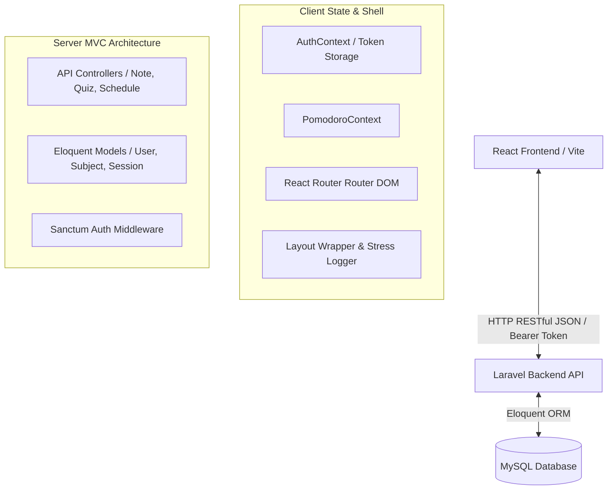
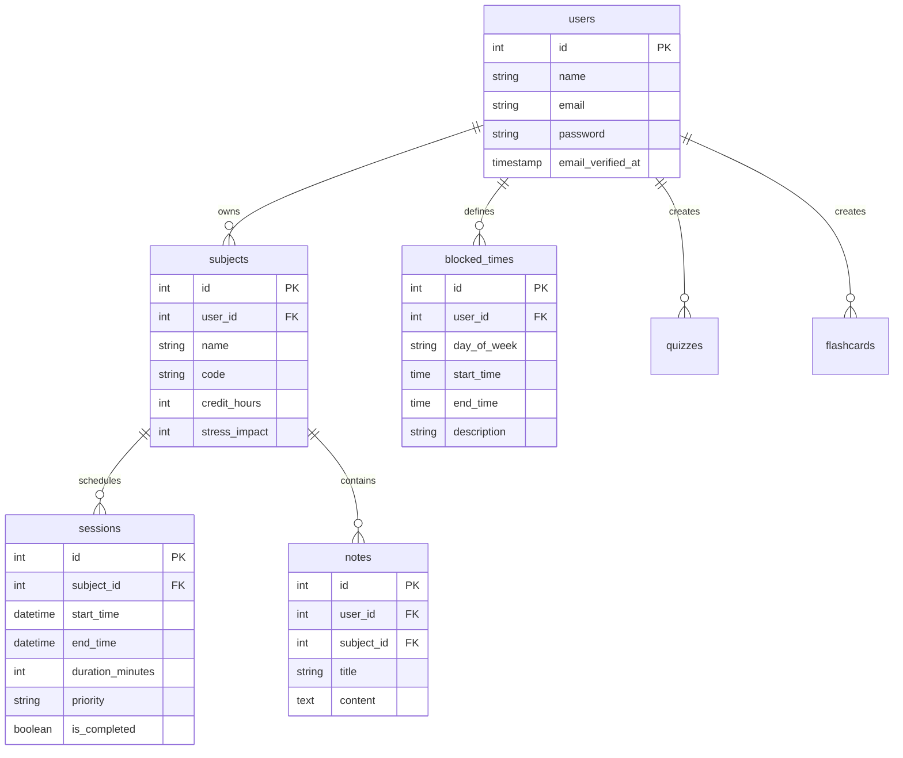

# SMARTPLANNER — Integrated Cognitive Productivity Workspace
> **A Final Year Project (FYP) Submission**
>
> SMARTPLANNER is a full-stack, cognitive productivity workspace designed to help students manage academic courses, generate intelligent study schedules, log and track stress levels, compile interactive notes, and reinforce learning through flashcards and quizzes, integrated with a task-aware Pomodoro focus tracker.

---

## 💻 Technical Overview & Architecture

SMARTPLANNER utilizes a modern, decoupled full-stack architecture built to optimize performance, maintainability, and clean separation of concerns.



### 1. The Frontend (`smart-planner-client`)
- **Core Library**: React 18
- **Build System**: Vite (highly optimized, fast hot module replacement)
- **Routing**: React Router DOM (supports route guarding and single-page routing)
- **Styling & Design System**: Premium Vanilla CSS utilizing **Tailwind-like custom HSL variables**, glassmorphism, responsive flex/grid layouts, smooth CSS transitions, and subtle hover animations.
- **Icons**: Lucide React for rich vector icons.

### 2. The Backend (`smart-planner`)
- **Framework**: Laravel 11 (PHP 8.2+)
- **Authentication**: Laravel Sanctum (stateful token-based authentication via bearer authorization headers)
- **Database Engine**: MySQL / MariaDB managed through standard Laravel migrations and database seeders.
- **ORM & Relations**: Eloquent ORM implementing strict models and dynamic data serialization.

---

## 🗄️ Database Schema & Data Models

The relational database schema is structured to ensure fast query times, data integrity, and strict cascade delete rules.



### Main Database Tables

1. **`users`**: User records, including hashed credentials and session tokens.
2. **`subjects`**: Courses/subjects created by students. Features properties like `credit_hours` and a customizable `stress_impact` weight (used in cognitive planning).
3. **`sessions` (Schedules)**: Calculated individual study periods associated with a subject. Contains `start_time`, `end_time`, `duration_minutes`, `priority`, and `is_completed`.
4. **`blocked_times`**: Time blocks specified by the student (e.g., classes, sleep, part-time jobs) which the scheduling algorithm automatically avoids.
5. **`notes`**: Subject-specific study logs and rich text summaries.
6. **`quizzes` & `questions`**: Quizzes constructed by students for mock-testing, supporting multiple-choice questions, timers, and public link generation tokens.
7. **`flashcards`**: Flashcard decks for active recall study.

---

## 🎨 Key Features & Modules

### 1. Global Authentication & Guards
- Dynamic React router checking for valid `localStorage` credentials.
- Automatic routing redirects (`/login` for unauthorized views, protected home dashboard for authenticated accounts).
- SILENT background credential verification via `getMe()` upon initial page load to verify session validity.

### 2. The Cognitive Scheduling Engine & Blocked Times
- Students specify hours they are unavailable in the **Blocked Times** dashboard.
- The system automatically allocates study slots, matching high-priority subjects with fresh slots while respecting the user's weekly constraints.

### 3. State-Aware Task Pomodoro Focus Widget
- **Intelligent Scope**: Pulls active study tasks dynamically (`todaySessions`) based on the current calendar day.
- **Auto-Logging Progress**: Once the 25-minute Pomodoro timer completes, it automatically prompts and logs the session to the backend database as `completed`, firing a global `study-progress-updated` custom event to immediately refresh the progress graphs on the screen.
- **Smart Mounting**: The widget automatically hides when a user is not logged in to maintain a clean login page layout, preventing unnecessary background API requests.

### 4. Interactive Assessment Suites (Quizzes & Flashcards)
- **Active Recall**: Flashcard player featuring double-sided flipping cards.
- **Mock Assessments**: Live quiz taking with a real-time countdown timer, validation checkmarks, and overall score summaries.
- **Public Shareability**: Generate unique, randomized access tokens to share custom quizzes with peer groups without requiring guest sign-ins.

### 5. Stress Level Tracker
- Sidebar-linked global slider allowing the user to record their mental fatigue levels.
- Feeds cognitive data down to dashboard layouts to adjust study frequency suggestions.

---

## 🛠️ Step-by-Step Installation & Setup

### Prerequisites
- **Web Server**: Apache / Nginx (XAMPP recommended for Windows)
- **Database**: MySQL / MariaDB
- **Languages**: PHP (version 8.2+) and Node.js (version 18+)
- **Dependency Managers**: Composer (for PHP) and NPM (for Javascript)

---

### Backend Setup (`smart-planner`)

1. Open your terminal and navigate to the backend directory:
   ```bash
   cd smart-planner
   ```

2. Install Composer dependencies:
   ```bash
   composer install
   ```

3. Create your local environment configuration:
   ```bash
   cp .env.example .env
   ```

4. Configure your `.env` database details:
   ```env
   DB_CONNECTION=mysql
   DB_HOST=127.0.0.1
   DB_PORT=3306
   DB_DATABASE=smart_planner_db
   DB_USERNAME=root
   DB_PASSWORD=
   ```

5. Generate the application key:
   ```bash
   php artisan key:generate
   ```

6. Run migrations to create the database schemas:
   ```bash
   php artisan migrate --seed
   ```

7. Start the local server:
   ```bash
   php artisan serve
   ```
   *The backend API will run on `http://127.0.0.1:8000`.*

---

### Frontend Setup (`smart-planner-client`)

1. Navigate to the client directory:
   ```bash
   cd ../smart-planner-client
   ```

2. Install NPM packages:
   ```bash
   npm install
   ```

3. Configure your API base URL variables. Create a `.env` file in `smart-planner-client/`:
   ```env
   VITE_API_URL=http://127.0.0.1:8000/api
   ```

4. Start the development server:
   ```bash
   npm run dev
   ```
   *The frontend client application will start on `http://localhost:3000`.*

---

## 💡 Key Design Patterns Used
* **React Provider Pattern (Context API)**: Clean, global state isolation for both user sessions (`AuthContext`) and focus states (`PomodoroContext`).
* **Route Guarding Pattern**: Securing routes with a custom `<ProtectedRoute>` component to ensure zero database leakages to public screens.
* **Component Composition Pattern**: Utilizing unified Layout wrappers that automatically pass cognitive metrics down to active dashboards.
* **Database Relational Integrity Pattern**: Strong foreign key mappings ensuring clean transactional states.
